# Personal Notifier

A simple app that can receive notifications via API.

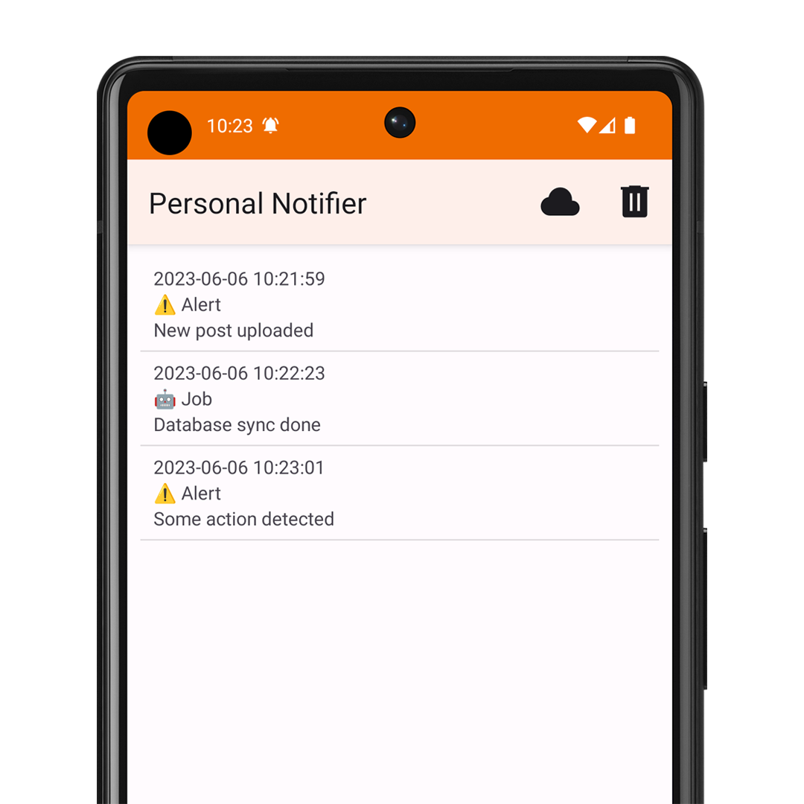

## Requirements

### Google Firebase

1. Create a project.

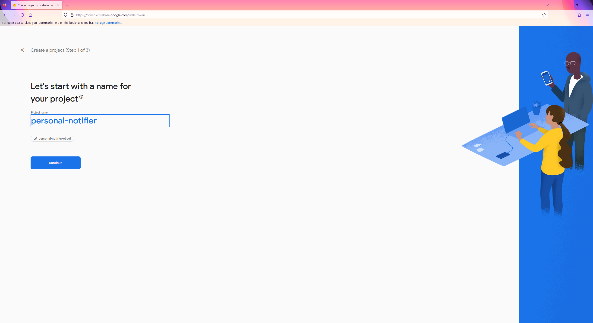

2. Add an app (select Android).

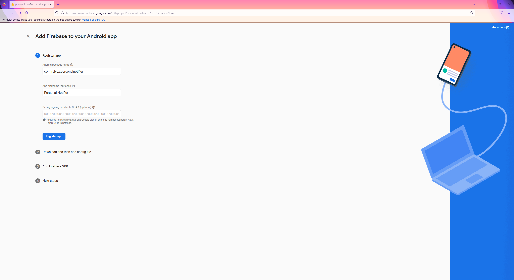

3. Download `google-services.json`.

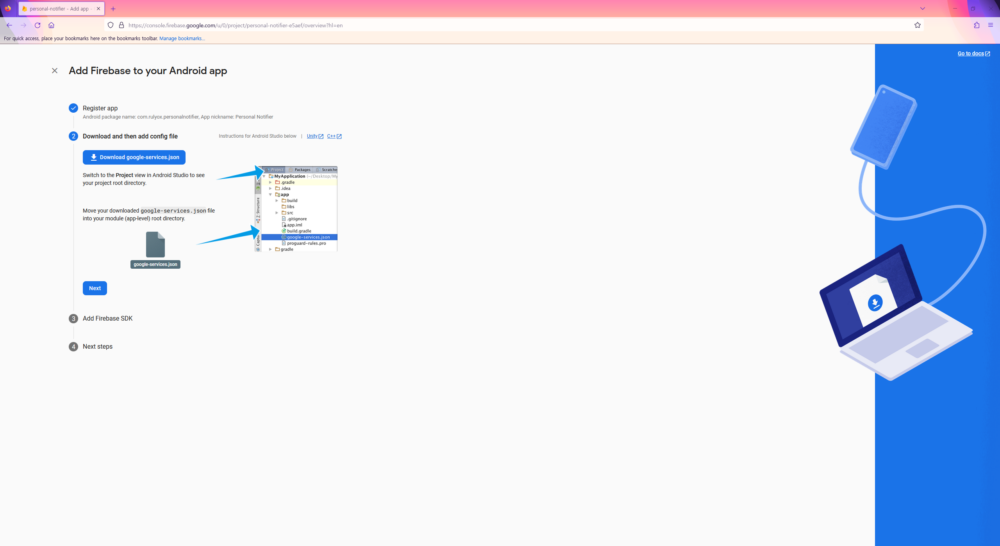

4. Go to `Project settings` - `Service accounts` and download the private key.

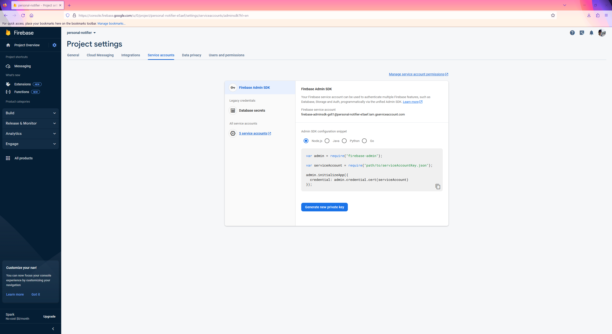

### Android

1. Place the file downloaded in `Firebase Step 3` in `app/google-services.json`.

2. Build and install the app.

3. (Optional) Testing if your device can receive a Firebase message.
    - Go to `Engage` - `Messaging` - `Create your first campaign` - `Firebase Notification messages`.
    - Write something and click `Send test message`.
    - Paste your device's token and click  `Test`.
    - A message will be received.
    - The received message's title and body will be null because a custom format is being used in this app.

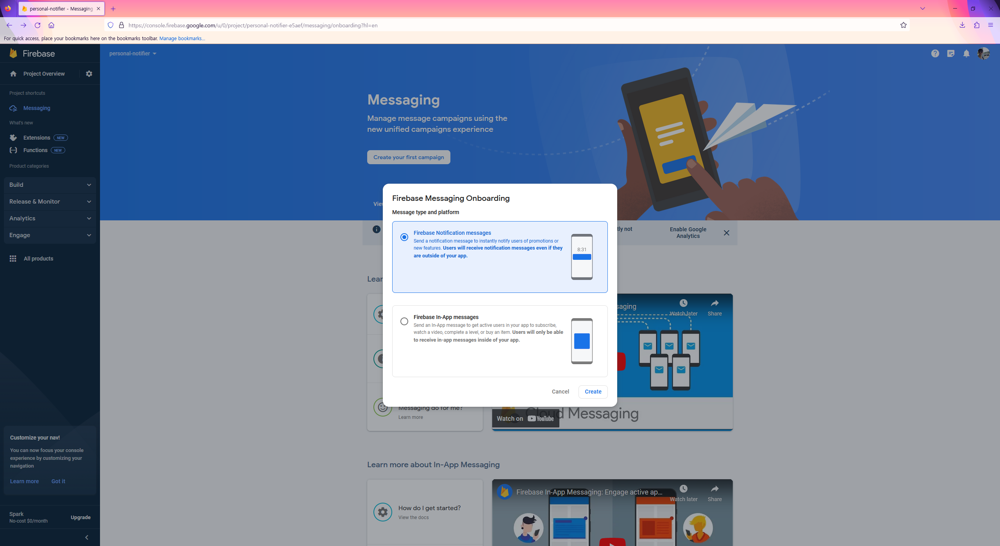

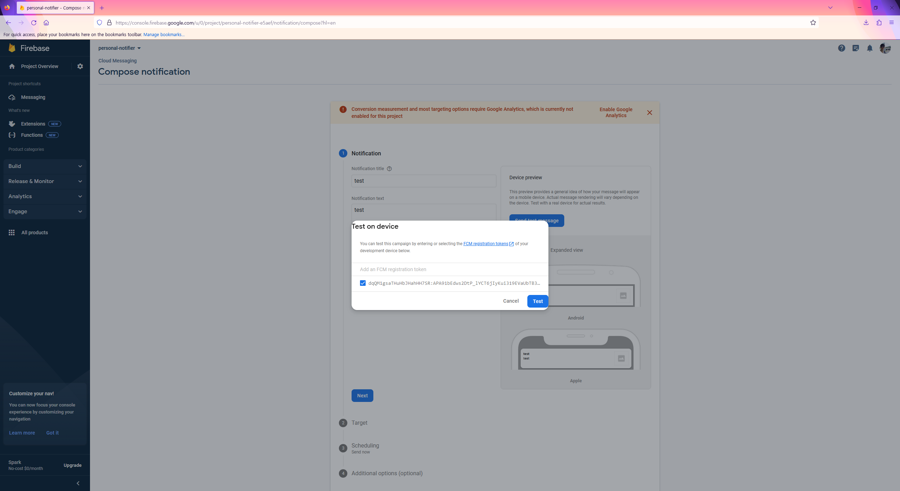

### AWS Lambda

1. Create a `Lambda` function using Node.js as the runtime.

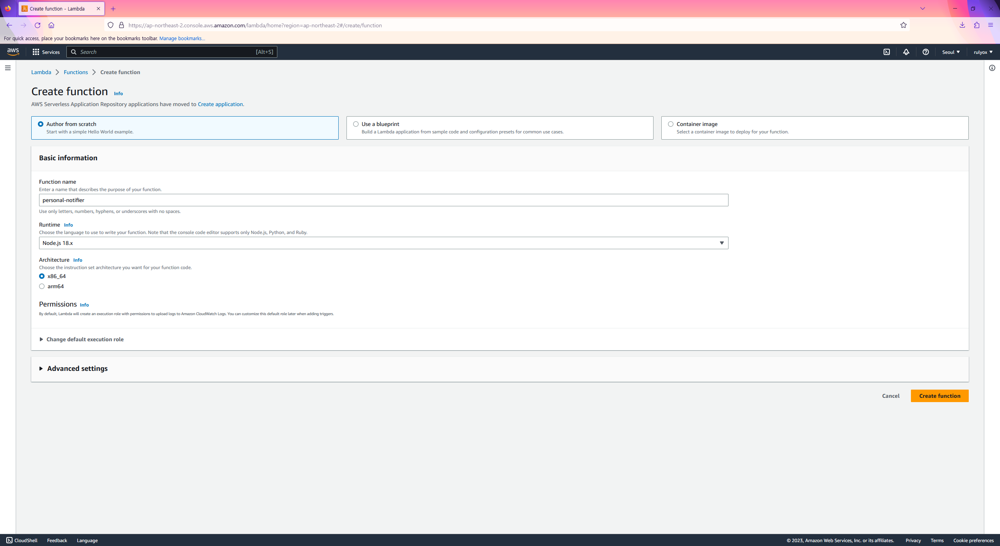

2. Create a `API Gateway` HTTP API and select the created Lambda as an Integration.

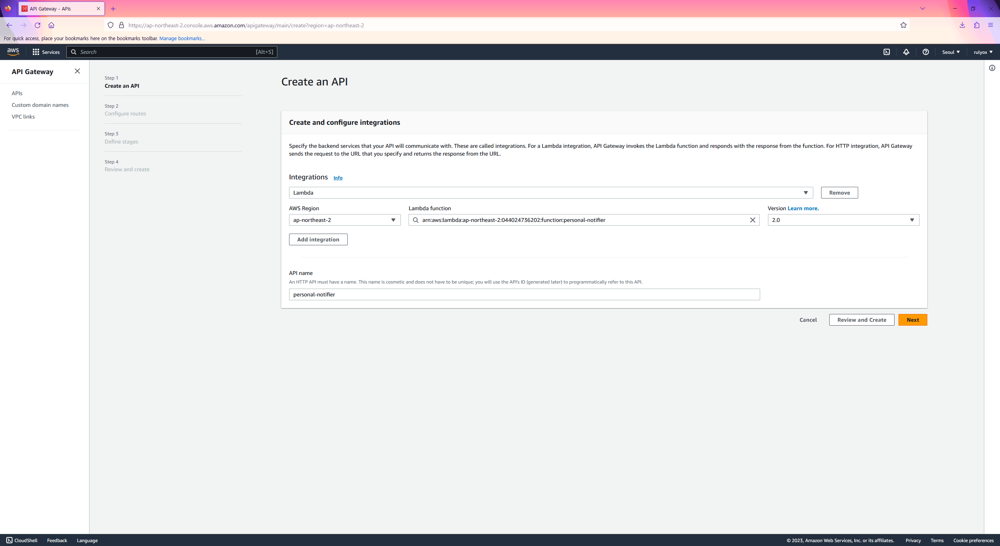

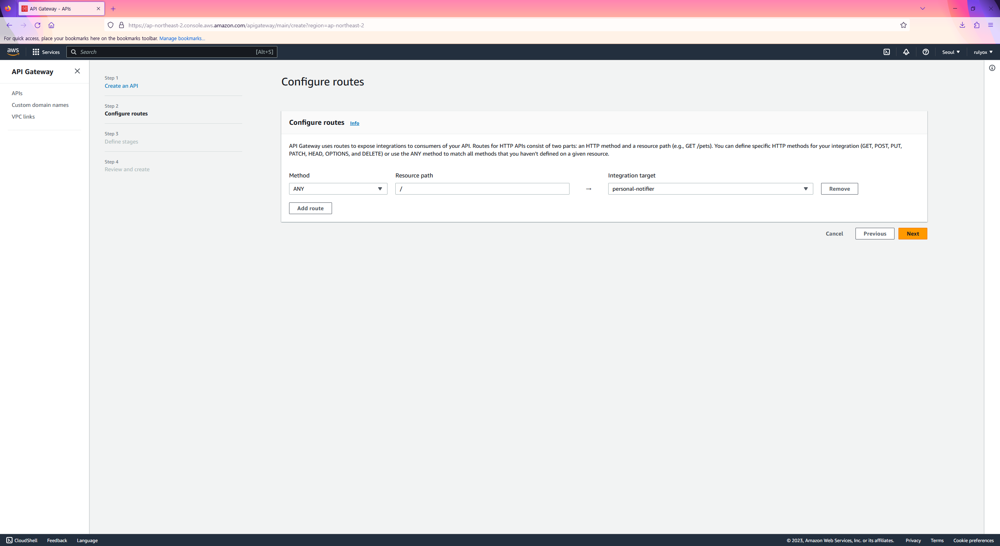

3. Rename the file downloaded in `Firebase Step 4` to `firebase_service_account.json` and place it in `lambda/firebase_service_account.json`.

4. Run `npm install` to install the required packages.

5. Zip the `lambda` directory and upload it to Lambda.

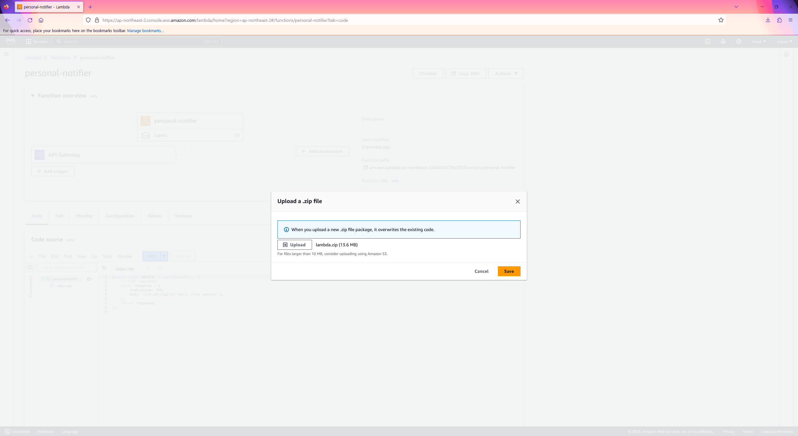

## Usage

Send a request to your Lambda endpoint to push a message.

```
POST https://[Your Endpoint].execute-api.ap-northeast-2.amazonaws.com/
{
    "title": "Remote Notification",
    "body": "Hello, world!",
    "targetToken": "[Your Token]"
}
```

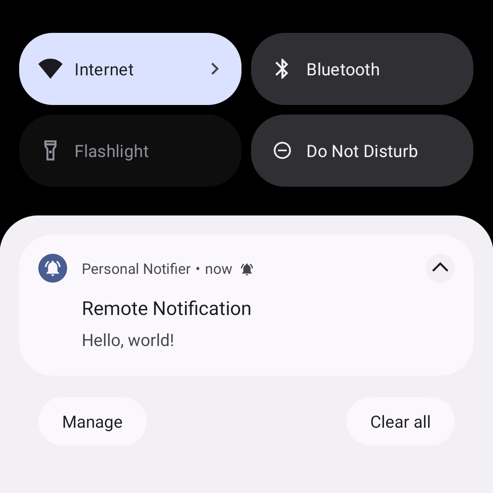
